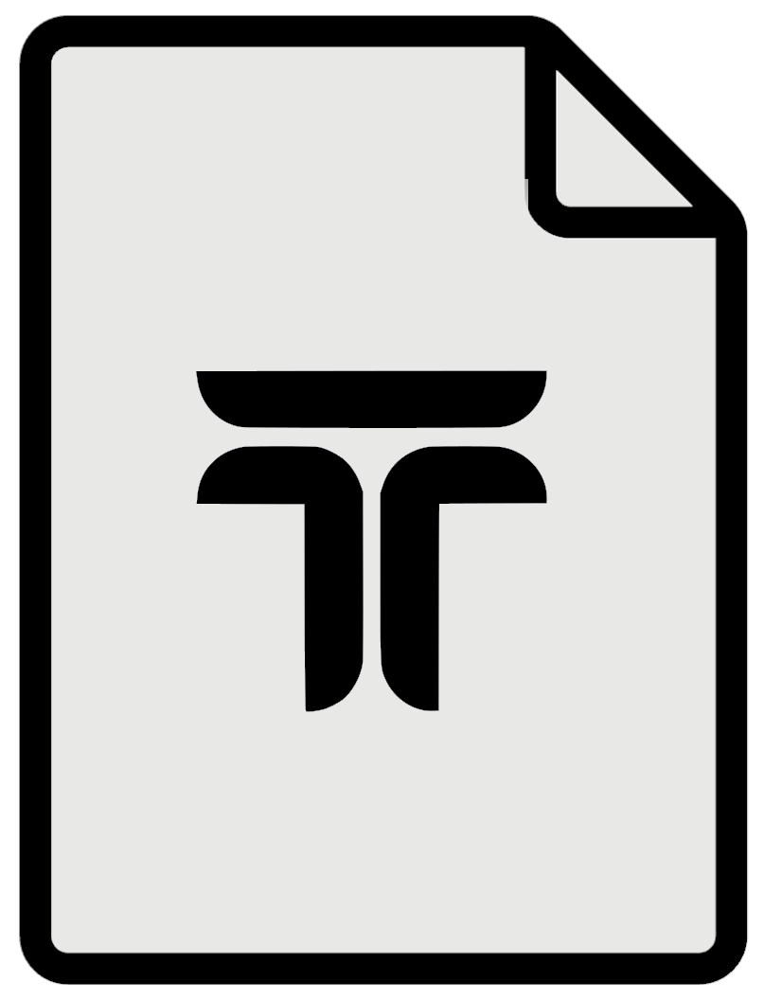
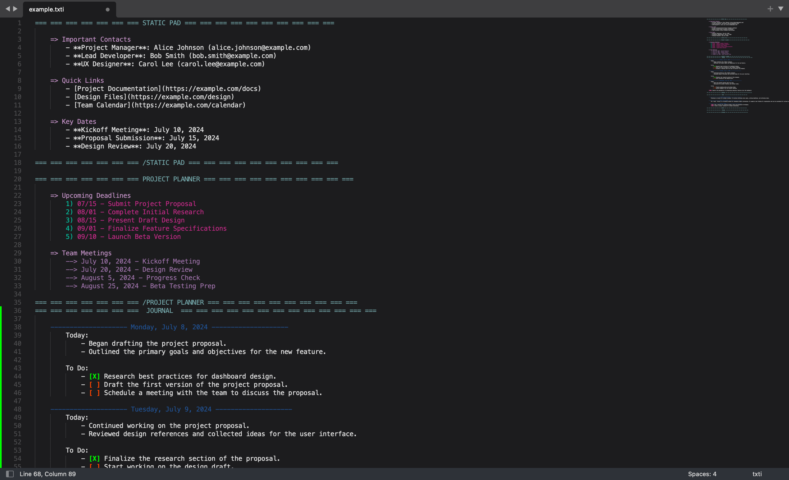

# texti (.txti) File Format 

Welcome to the `texti` file format! The `.txti` extension is designed to help you organize and manage a variety of information in a single, structured text file. This guide will walk you through the basics of the `texti` format, how to use it, and the conventions you’ll need to follow.


Texti files work best in [sublime](https://www.sublimetext.com/)!

## Table of Contents

1. [Introduction](#introduction)
2. [Editor Requirements](#editor-requirements)
3. [File Structure](#file-structure)
4. [Sections and Keywords](#sections-and-keywords)
5. [Examples](#examples)
6. [Using texti Files](#using-texti-files)
7. [Advanced Features](#advanced-features)
8. [Best Practices](#best-practices)
9. [Installing texti in Sublime Text](#installing-texti-in-sublime-text)
10. [Contributing](#contributing)
11. [License](#license)

## Introduction

The `texti` file format is a text-based system for organizing information into sections with foldable elements. It’s designed to be used with text editors like Sublime Text, which support text folding to help manage large amounts of information.

## Editor Requirements
The texti file format relies on text editors that support text folding using tabbed sections. The primary feature you need is the ability to collapse and expand sections based on the headers and dividers in your .txti file.

**Why Folding is Essential**
- Organize Large Files: Folding allows you to manage large files by collapsing sections you’re not currently working on, keeping the interface clean and focused.
- Navigate Easily: With sections folded and expanded, you can quickly navigate between different parts of your file without being overwhelmed by too much information.
- Visual Clarity: Proper folding helps maintain a clear visual structure of your file, ensuring that your organizational scheme is both visible and functional.

For the best experience with texti, use editors like Sublime Text that have robust support for text folding and customizable syntax highlighting.

## File Structure

A `.txti` file is organized into **sections**, which are delineated by headers and dividers. Each section can contain text, lists, and various types of content. Here’s a basic overview of the file structure:

```plaintext
=== === === === === === === SECTION TITLE === === === === === === === === === ===
    Content goes here
=== === === === === === === /SECTION TITLE === === === === === === === === === ===
```

- **Section Header:** `=== === === === === === === SECTION TITLE === === === === === === === === === ===`
- **Section Divider:** `=== === === === === === === /SECTION TITLE === === === === === === === === === ===`

## Sections and Keywords

### Static Pad

A **Static Pad** section is used for fixed information that you might refer to frequently, such as schedules or contact lists.

**Example:**

```plaintext
=== === === === === === === STATIC PAD  === === === === === === === === === ===
    => Project Deadlines
        1) Initial Proposal: 8/10
        2) Mid-Project Review: 9/15
        3) Final Submission: 11/30

    => Meeting Notes
        --> 2024-07-10: Kickoff Meeting
            - Discuss project goals and deliverables
        --> 2024-08-05: Status Update
            - Review progress and address issues
        --> 2024-09-12: Team Check-In
            - Ensure alignment with project timeline
=== === === === === === === /STATIC PAD === === === === === === === === === ===
```

### Notes

The **Notes** section is for miscellaneous information, ideas, or reflections. It can include text, markdown, or any other simple format.

**Example:**

```plaintext
=== === === === === === ===  NOTES  === === === === === === === === === === ===
    ------------------------ About Markdown --------------------------
        Markdown is a lightweight markup language with plain text formatting syntax.
        It's widely used for documentation and note-taking.

    -------------------- texti Features ---------------------
        The texti format supports section folding, easy organization, and the ability to
        integrate simple text-based interfaces.
=== === === === === === === /NOTES  === === === === === === === === === === ===
```

### Storage

The **Storage** section is used for storing detailed information like documents or structured data.

**Example:**

```plaintext
=== === === === === === ===  STORAGE    === === === === === === === === === ===
    ========================= TO-DO LIST =========================================
        -------------------- Work Tasks -----------------
        - Finish draft of research paper
        - Prepare presentation slides for conference
        - Submit grant application

        -------------------- Personal Tasks -----------------
        - Buy groceries
        - Schedule dentist appointment
        - Organize home office
=== === === === === === === /STORAGE    === === === === === === === === === ===
```

### Journal

The **Journal** section is for daily entries, task lists, and reflections.

**Example:**

```plaintext
=== === === === === === ===  JOURNAL    === === === === === === === === === ===
    ------------------------Friday, July 5th 2024----------------------------
        Today:

        I plan to finish the draft for my research paper and prepare for the upcoming conference.
        I will also take some time to organize my study materials.

        For today:
            [ ] Complete research paper draft
            [ ] Prepare conference slides
            [ ] Organize study materials

        !IDEA: Develop a plugin for text editors to support text-based project management
    ---------------------------------------------------------------------------
=== === === === === === ===  /JOURNAL   === === === === === === === === === ===
```

### TODO Lists

The `texti` format is well-suited for managing to-do lists. Whether you’re keeping track of work tasks, personal goals, or project milestones, you can use the `texti` format’s features to organize and prioritize your tasks effectively.

#### Creating To-Do Lists

To create a to-do list in a `.txti` file, use the following syntax:

```plaintext
=== === === === === === === TO-DO LIST === === === === === === === === === ===
    -------------------- Work Tasks -----------------
    - [ ] Finish draft of research paper
    - [ ] Prepare presentation slides for conference
    - [ ] Submit grant application

    -------------------- Personal Tasks -----------------
    - [ ] Buy groceries
    - [ ] Schedule dentist appointment
    - [ ] Organize home office

    -------------------- Ideas -----------------
    - [ ] Develop a plugin for text editors to support text-based project management
=== === === === === === === /TO-DO LIST === === === === === === === === === ===
```

#### Task Syntax

- **Unchecked Task:** `[ ] Task Description`
- **Checked Task:** `[X] Task Description`

#### Visual Representation in Sublime Text

With the `texti` syntax highlighter, you will see the following color coding for your to-do lists:

- **Unchecked Tasks:** `[ ]` will be highlighted in **red**, making it easy to see tasks that still need to be completed.
- **Checked Tasks:** `[X]` will be highlighted in **green**, helping you track which tasks are finished.

## Using texti Files

1. **Creating a `.txti` File:** Start with a blank text file and save it with the `.txti` extension.
2. **Organizing Information:** Use sections to categorize your information. Create headers and dividers as needed.
3. **Folding Sections:** In Sublime Text, you can use the text folding feature to collapse and expand sections.

## Best Practices

- **Keep Sections Clear:** Ensure that each section has a clear purpose and label.
- **Use Descriptive Headers:** Choose section titles that clearly describe the content.
- **Update Regularly:** Regularly update your `.txti` file to keep information current.

## Installing texti in Sublime Text

To get the best experience using the `texti` file format in Sublime Text, you need to install the custom syntax highlighting and color scheme files. Follow these steps to set them up:

### 1. Download the Files

Download the following files from our [GitHub repository](https://github.com/trevortomesh/texti):
- `txti.sublime-color-scheme`
- `txti.sublime-syntax`

### 2. Locate the Sublime Text Packages Directory

Depending on your operating system, navigate to the Sublime Text packages directory:

- **Windows:** `%APPDATA%\Sublime Text\Packages`
- **macOS:** `~/Library/Application Support/Sublime Text/Packages`
- **Linux:** `~/.config/sublime-text/Packages`

### 3. Copy the Files

Copy the downloaded `txti.sublime-color-scheme` and `txti.sublime-syntax` files into the `Packages` directory.

### 4. Apply the Color Scheme and Syntax

1. **Open Sublime Text.**
2. **Set the Syntax:** Go to `View` > `Syntax` > `Open all with current extension as...` > `txti` to apply the `txti` syntax highlighting.
3. **Set the Color Scheme:** Go to `Preferences` > `Color Scheme` > `txti` to select the `txti` color scheme.

This will enable syntax highlighting and a custom color scheme for `.txti` files, enhancing your editing experience.

## Contributing

If you have suggestions or improvements for the `texti` format, please feel free to contribute! Open an issue or submit a pull request on our [GitHub repository](https://github.com/trevortomesh/texti).

## License

This project is licensed under the [MIT License](LICENSE).
